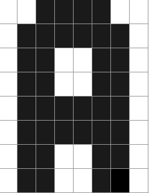

# Auftrag 5

## B1

### 1. Huffman-Algorithmus

10001000100110001010101111000110010110100110 11011

### 2. RLC/E-Verfahren

### 3. LZW-Verfahren
ANANAS LZW-Kodierung: 65 78 256 65 83
Dekodierung von ERDBE<256>KL<260>: ERDBEERKLЕЕ

### 4. ZIP-Kodierung